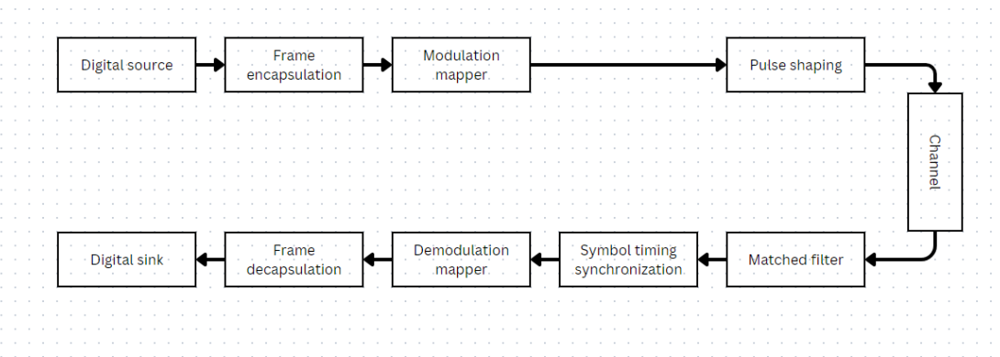

# ECE 529 Symbol Synchronization
This repository contains the Python code my transceiver chain which compares symbol synchronization algorithms. I wrote it for the digital signal processing class ECE 529 at the University of Arizona. It compares the performance of various symbol timing synchronization algorithms for Differential Bipolar Phase Shift Keying (DBPSK). Symbol timing synchronization involves determining the instants in a signal received by a receiver at which symbols from the transmitter begin. The performance metric is the bit-error rate for different loop gains and noise levels. The algorithms I selected are Early-Late Gate, Mueller and Muller (MM), and Gardner. The result of this project is a set of graphs for performance comparison and guidance in algorithm selection based on different requirements.

## Documentation
The project is documented in the included [26-page provided report](report.pdf)

## Transceiver Chain

## Modulated Signal

## Signal with Channel White Gaussian Noise and Fractional Delay

## Filtered Signal

## Symbol Synchronizer Model

## Signal with Synchronized Symbol Markings

